# Actividad Unidad 5 - Automatización del ciclo de vida de una Aplicación. naiara
## PREPARACIÓN DEL LABORATORIO
1. Para comenzar creo una variable con mi nombre, una carpeta en la cual realizaré la activida y me coloco en ella.
```bash
# crea variable con tu nombre
TuNombre=naiara
# Creamnos carpeta
mkdir -p Unidad5/Actividad-CicloVida
# Nos colocamos en ella
cd Unidad5/Actividad-CicloVida
```
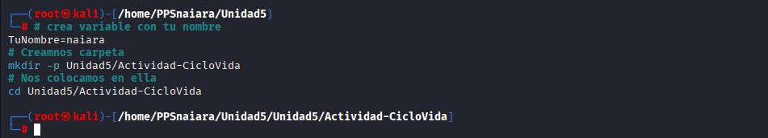
1. Compruebo que está instalado *java 11* en la máquina virtual con el comando:
```bash
update-alternatives --list java
```
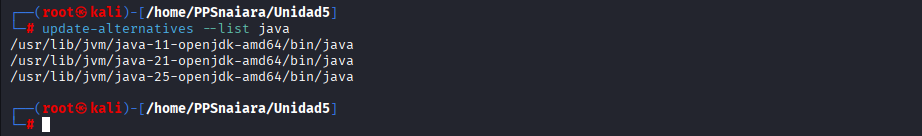
1. Le indico al sistema que quiero usar *java11*
```bash
# elegimos java-11
sudo update-alternatives --config java
# elegimos java-11
sudo update-alternatives --config javac
```
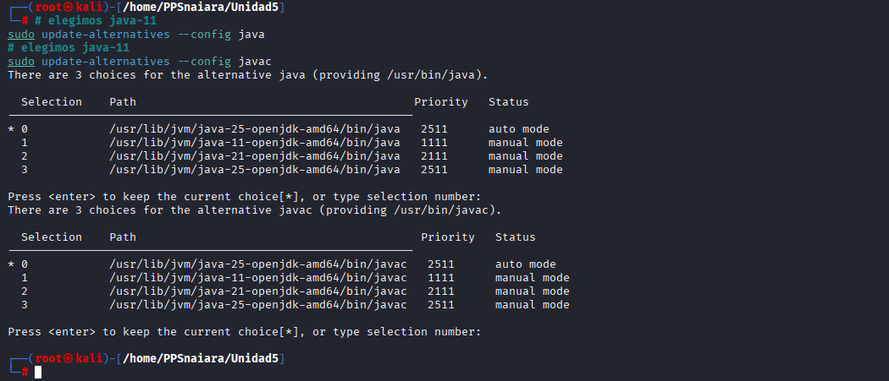
1. **Decomprimo** la aplicación, para ello debo descargarla [aqui](https://github.com/jmmedinac03vjp/PuestaProduccionSegura/blob/main/Unidad5-SistemasDesplegadoAutomatizadoSoftware/Actividad-AutomatizacionCicloVidaAplicacion/files/store-app-postgree.zip) usando los siguientes comandos:
```bash
# coloca store-app-postgree.zip en la carpeta
# descomprime 
unzip store-app.zip 
# comprueba que se ha descomprimido
cd store-app
```
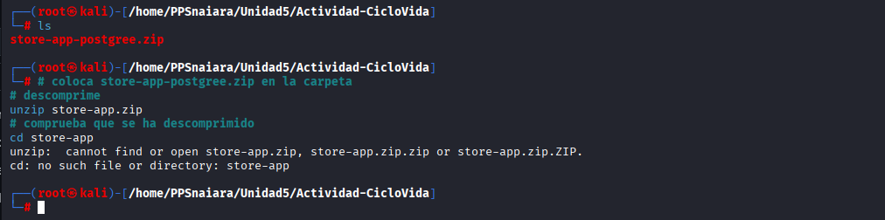
1. Descargo los archivos [./Dockerfile](https://github.com/jmmedinac03vjp/PuestaProduccionSegura/blob/main/Unidad5-SistemasDesplegadoAutomatizadoSoftware/Actividad-AutomatizacionCicloVidaAplicacion/files/Dockerfile) y el [manifiesto de despliegue de kubernetes](https://github.com/jmmedinac03vjp/PuestaProduccionSegura/blob/main/Unidad5-SistemasDesplegadoAutomatizadoSoftware/Actividad-AutomatizacionCicloVidaAplicacion/files/store-app-k8s.yaml) en la carpeta que acabo de descomprimir.
2. Subo los cambios al repositorio
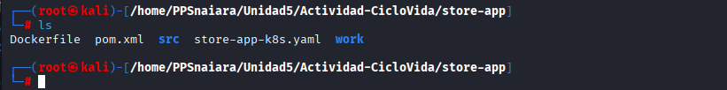
1. Compruebo que tengo instalado ***Maven*** con:
```bash
# comprobamos versión de maven
mvn --version
# sino tenemos instalamos
# sudo apt udate; sudo apt install maven 
```
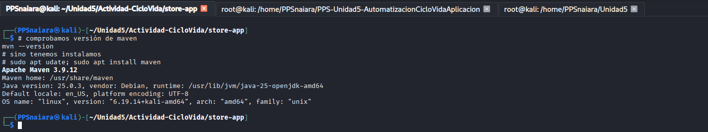
1. Doy permisos para ejecutar ***Docker*** a ***Jenkins***
```bash
sudo usermod -aG docker jenkins
sudo systemctl restart jenkins
``` 
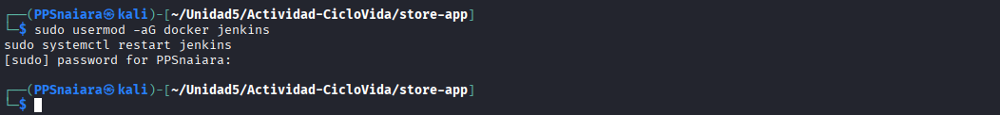

## CREAR CICLO DE VIDA COMPLETO EN EL EQUIPO LOCAL
### Maven package: validate, compile, test, package
1. Compruebo que tengo *java 11*
```bash
java --version
```
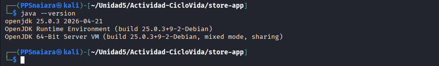
2. Realizamos operaciones *validate*, *compile* con ***maven***:
```bash
# realizamos operaciones en maven
mvn compile
```
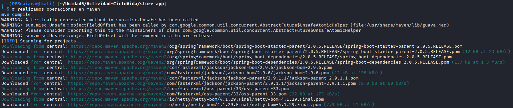
1. Pasamos los **test** con maven:
```bash
# realizamos operaciones en maven
mvn test
```
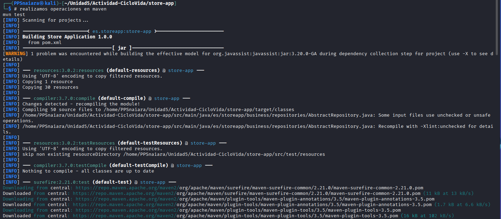
1. Realizamos **operación package** con ***maven*** para generar el código compilado:
```bash
# realizamos operaciones en maven
mvn package
```
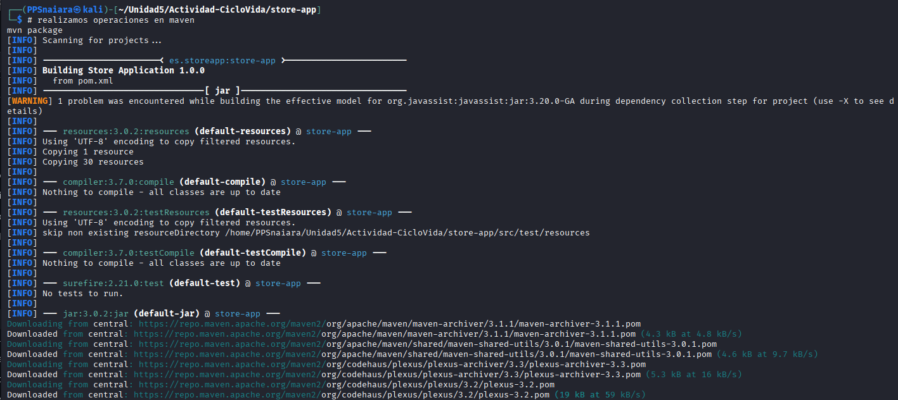
1. **Comprobamos que no hay errores** y se ha generado el *artifact*:
```bash
# listamos /target y veremos el artifact (.jar generado)  store-app-1.0.0.jar
ls ./target
```
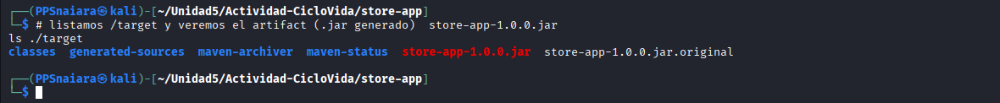

### Deploy: Construir imagen y levantar máquinas
1.  Creo una **imágen Docker** a partir de Dockerfile, empaquetando la JVM, el .jar y la ocnfiguración necesaria para que la aplicación se ejecute de manera ***aislada y reproducible***:
```docker
# ===== RUNTIME =====
# Imagen solo JRE Java 11
FROM eclipse-temurin:11-jre

# Directorio de trabajo dentro del contenedor en producción
WORKDIR /app

# Copia el .jar generado en el stage de build hacia el contenedor de runtime
# Usa --from=build para acceder a lo construido en el stage anterior
COPY target/*.jar app.jar

# Indica el puerto por el que la aplicación escuchará dentro del contenedor
EXPOSE 8888

# Comando que se ejecuta al arrancar el contenedor: ejecuta la aplicación Java empaquetada
ENTRYPOINT ["java","-jar","app.jar"]
```
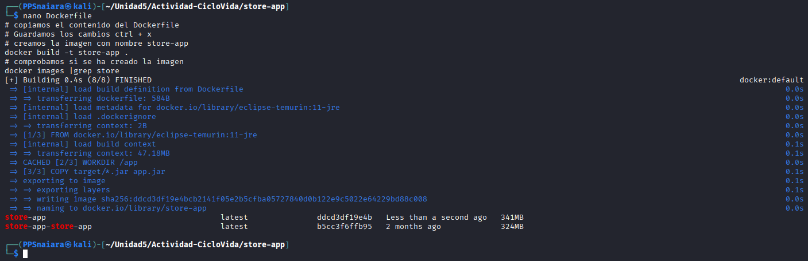
Copio Dockerfile, creo la imagen y compruebo si se ha creado:
```bash
nano Dockerfile
# copiamos el contenido del Dockerfile
# Guardamos los cambios ctrl + x
# creamos la imagen con nombre store-app
docker build -t store-app .
# comprobamos si se ha creado la imagen
docker images |grep store
```
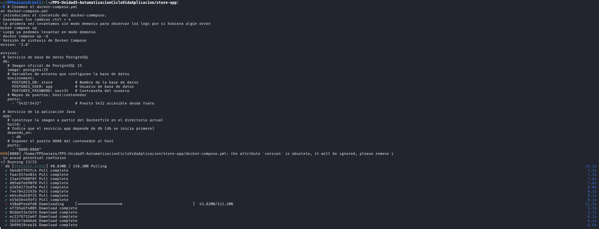
Accedo a la aplicación generada haciendo clic o navegando hasta http://localhost:8888
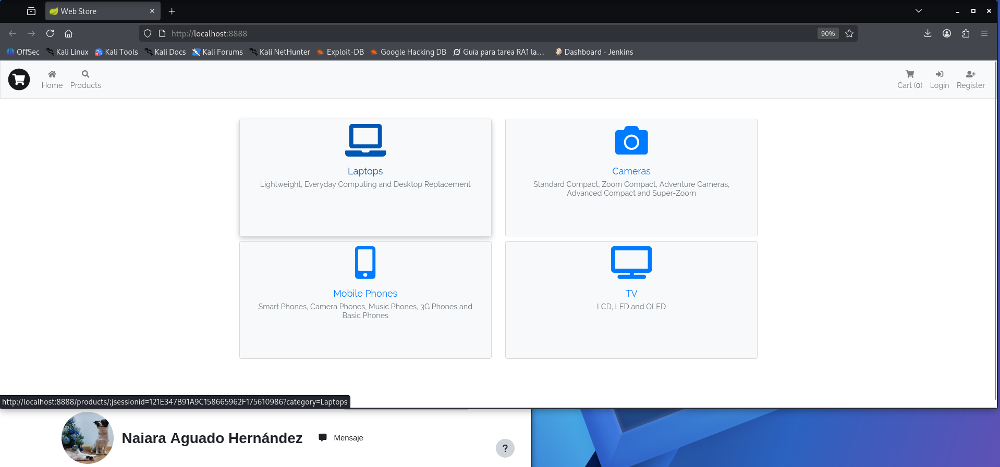
De esta forma, el ciclo de **CI/CD** se completa: ***Compilar → Testear → Generar el jar → Crear la imagen Docker → Desplegar*** el entorno con **docker-compose**.
Una ve terminado este escenario:
```bash
docker compose down
```
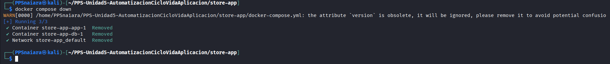

## AUTOMATIZACIÓN DE CONSTRUCCIÓN CON JENKINS
### Preparación del entorno
Cambio a *java21* ya que ***Jenkins*** usa esa versión o superior:
```bash
# Dejábamos el java que teníamos
sudo update-alternatives --config java
# Dejábamos el java que teníamos
sudo update-alternatives --config javac
# comprobamos java > 21
java --version
```
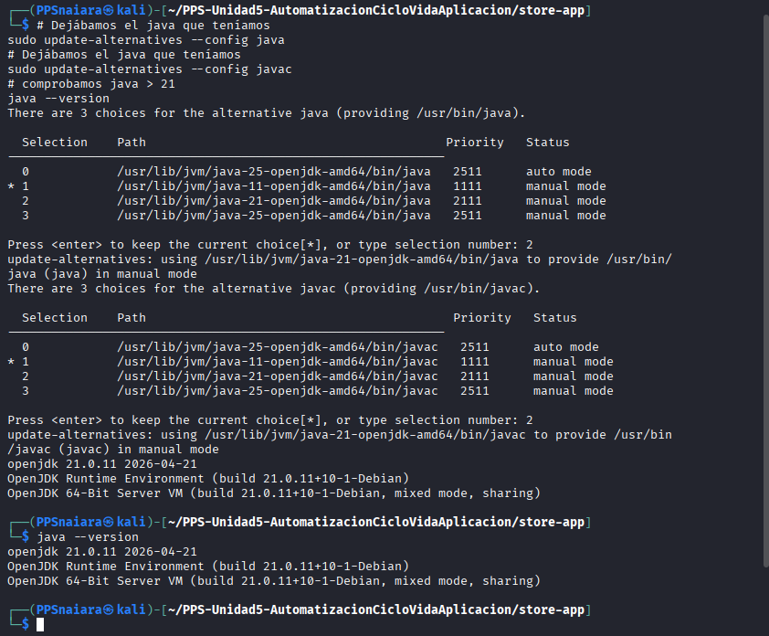
Arranco jenkins
```bash
service jenkins start
```
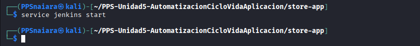
Accedo a Jenkins usando http://localhost:8080
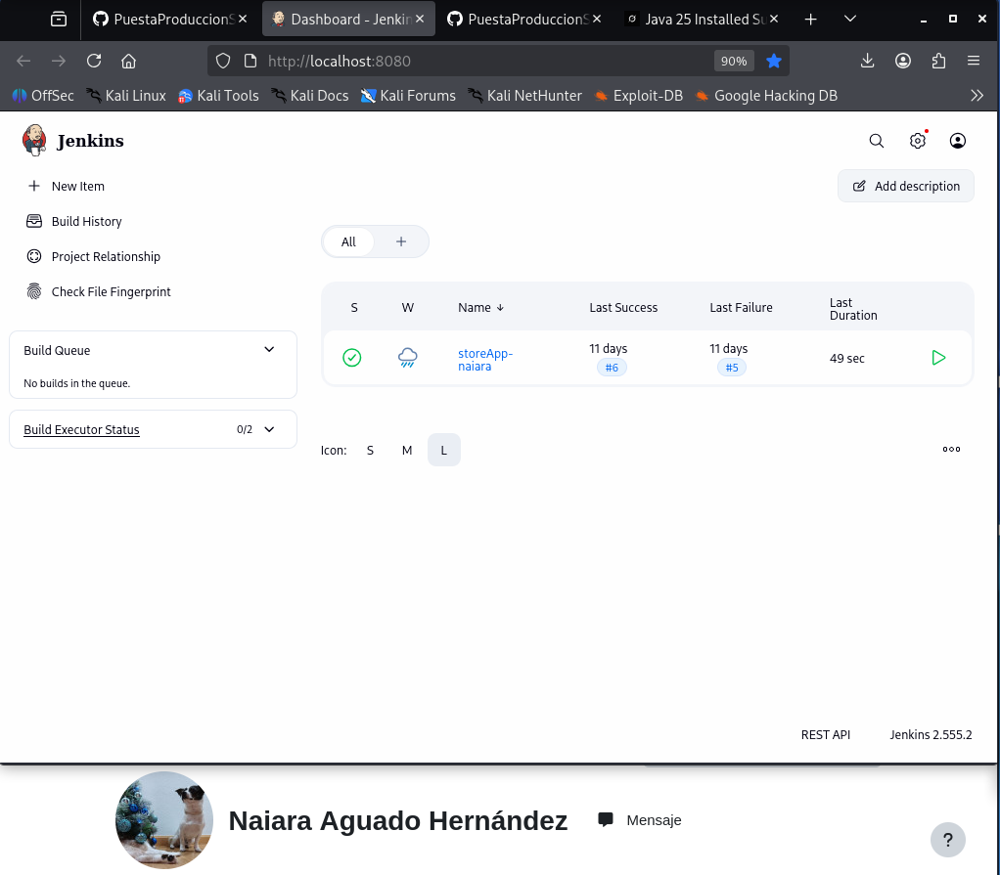
### Checkout del repositorio
A continuación en **Jenkins** creo una nueva tarea a la cual le voy a poner como nombre **CicloVidaJenkins** y el siguiente pipeline:
```jenkins
pipeline {
    agent any

    stages {
        stage('Clonar repositorio') {
            steps {
                git branch: 'main',
                credentialsId: 'TuIDToken', // Tu ID definido en Jenkins
                    url: 'https://github.com/PPSvjpOrganizacion/-PPSvjp.git'
            }
        }

        stage('Verificar contenido') {
            steps {
                sh 'echo "Repositorio clonado correctamente"'
                sh 'pwd'
                sh 'ls -la'
                sh 'git branch -a || true'
            }
        } 
    }

    post {
        success {
            echo 'Git clonado correctamente rectamente'
        }
        failure {
            echo 'La clonación ha fallado'
        }
        
    }
}
```
Por así decirlo se han hecho las siguientes etapas:
+ **Clonar** el repositorio
+ **Verifica el contenido**: hago en comando listado de directorio, y mostrando ramas.
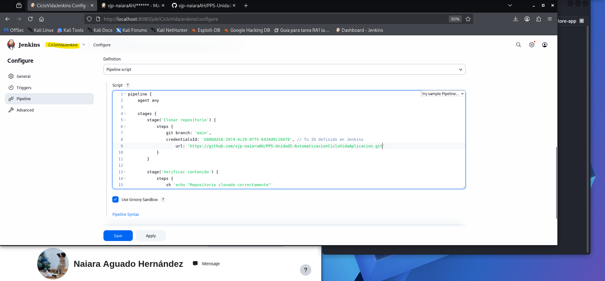

**Guardo los cambios** y lo **ejecuto**.
**compruebo la ejecución** en Tarea CicloVidaJenkins -> nºBuild -> Pipeline Overview.
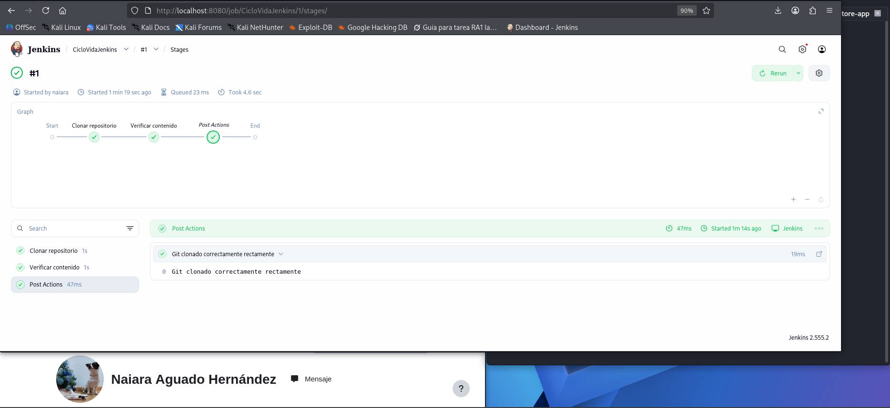

### Checkout del repositorio
Modifico el *pipeline* Tarea CicloVidaJenkins -> configurar y pego el siguiente:
```
pipeline {
    agent any

    stages {
        stage('Clonar repositorio') {
            steps {
                git branch: 'main',
                    credentialsId: 'b80b0d16-2974-4c29-8ff5-6434d9c184f8',
                    url: 'https://github.com/vjp-naiaraAH/PPS-Unidad5-AutomatizacionCicloVidaAplicacion.git'
            }
        }

        stage('Verificar contenido') {
            steps {
                sh 'echo "Repositorio clonado correctamente"'
                sh 'pwd'
                sh 'ls -la'
                sh 'ls -la store-app || true'
            }
        }

        stage('Test con Maven') {
            steps {
                dir('store-app') {  // ← Esta es la solución principal
                    withEnv(["JAVA_HOME=/usr/lib/jvm/java-11-openjdk-amd64",
                             "PATH+JAVA=/usr/lib/jvm/java-11-openjdk-amd64/bin"]) {
                        sh 'mvn clean test'
                    }
                }
            }
        }
    }

    post {
        success {
            echo '✅ Tests finalizados correctamente'
        }
        failure {
            echo '❌ Los tests han fallado'
        }
    }
}
```
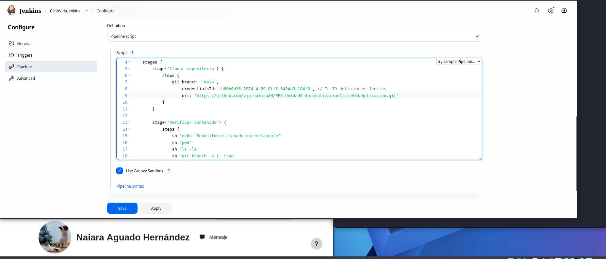
Y lo **compilo** y no da error como se ve
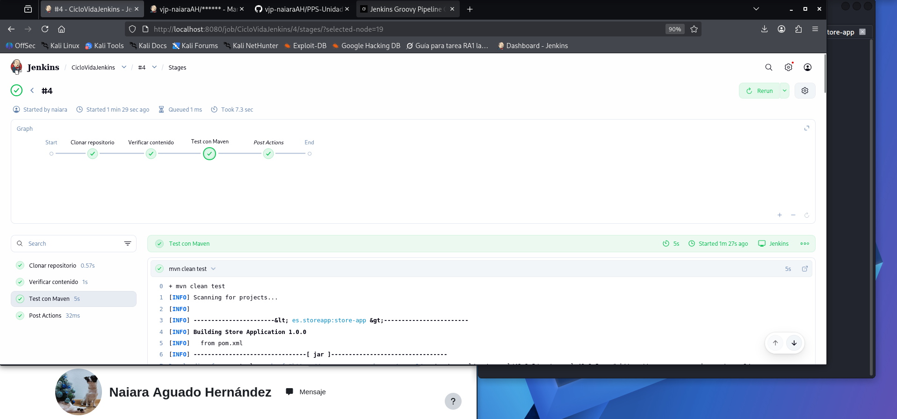
#### Package
Ahora hago el pipeline añadiendo el **package**
```jenckins
pipeline {
    agent any

    stages {
        stage('Clonar repositorio') {
            steps {
                git branch: 'main',
                    credentialsId: 'b80b0d16-2974-4c29-8ff5-6434d9c184f8',
                    url: 'https://github.com/vjp-naiaraAH/PPS-Unidad5-AutomatizacionCicloVidaAplicacion.git'
            }
        }

        stage('Verificar contenido') {
            steps {
                sh 'echo "✅ Repositorio clonado correctamente"'
                sh 'pwd'
                sh 'ls -la'
                sh 'ls -la store-app || true'
            }
        }

        stage('Test con Maven') {
            steps {
                dir('store-app') {
                    withEnv(["JAVA_HOME=/usr/lib/jvm/java-11-openjdk-amd64",
                             "PATH+JAVA=/usr/lib/jvm/java-11-openjdk-amd64/bin"]) {
                        sh 'mvn clean test'
                    }
                }
            }
        }

        stage('Package') {
            steps {
                dir('store-app') {
                    withEnv(["JAVA_HOME=/usr/lib/jvm/java-11-openjdk-amd64",
                             "PATH+JAVA=/usr/lib/jvm/java-11-openjdk-amd64/bin"]) {
                        sh 'mvn package -DskipTests'   // Empaqueta sin volver a ejecutar tests
                    }
                }
            }
        }
    }

    post {
        success {
            echo '✅ Pipeline finalizado correctamente - Aplicación empaquetada'
        }
        failure {
            echo '❌ El pipeline ha fallado'
        }
    }
}
```
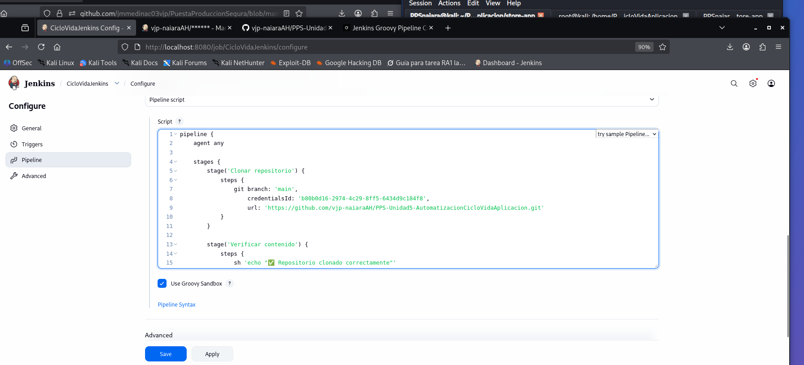
Guardo  vuelvo a ejecutar y no da ningun fallo.
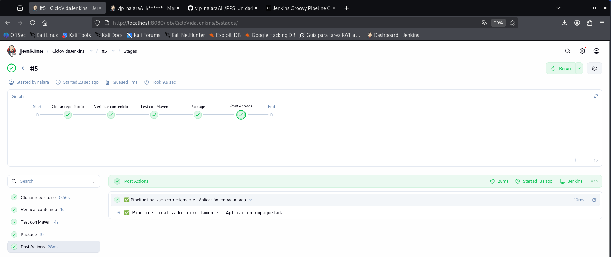
Voy a la ejecución y compruebo si esta generado el .jar
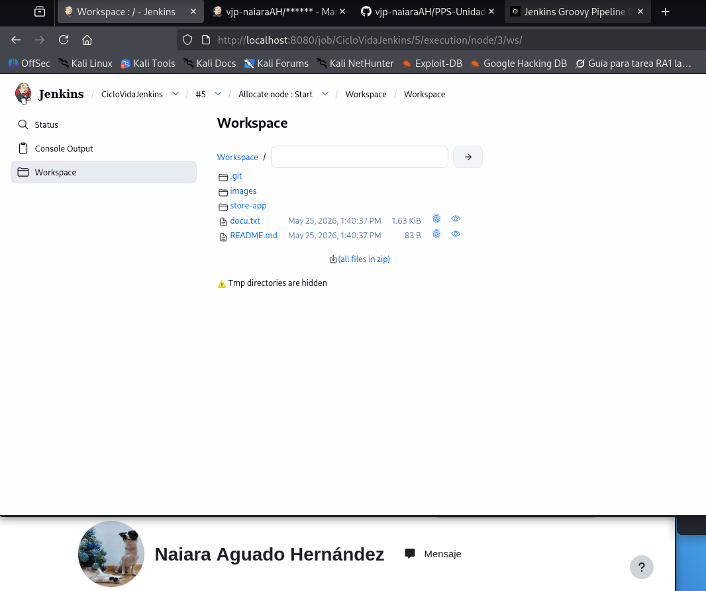

#### Automatización de etapa o herramienta con Jenkins
Creo un nuevo pipeline que se va a llamar añadir Jacoco(aunque al final no llevará jacoco).
Añadiré una **nueva etapa** automatizada de **análisis estático** utilizando ***Checkstyle***.
Con esta herramienta **revisaré automáticamente el código Java** para detectar **errores de estilo**, **malas prácticas** y posibles ***problemas de calidad*** antes de generar el paquete final de la aplicación.
Gracias a esta automatización, mi *pipeline* no solo compilará y ejecutará tests, sino que también **validará automáticamente la calidad del código** dentro del ciclo de vida **CI/CD.**
Resumiendo lo que hago es añadir una etapa extra la cual es 
+ Análisis estático (Checkstyle)
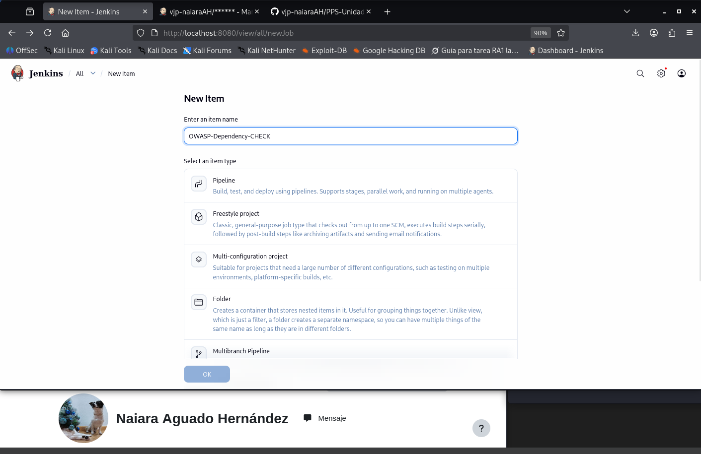

Le añado el script:
```jenkins
pipeline {
    agent any

    stages {
        stage('Clonar repositorio') {
            steps {
                git branch: 'main',
                    credentialsId: 'b80b0d16-2974-4c29-8ff5-6434d9c184f8',
                    url: 'https://github.com/vjp-naiaraAH/PPS-Unidad5-AutomatizacionCicloVidaAplicacion.git'
            }
        }

        stage('Verificar contenido') {
            steps {
                sh 'echo "✅ Repositorio clonado correctamente"'
                sh 'ls -la store-app || true'
            }
        }

        stage('Build + Test') {
            steps {
                dir('store-app') {
                    withEnv(["JAVA_HOME=/usr/lib/jvm/java-11-openjdk-amd64",
                             "PATH+JAVA=/usr/lib/jvm/java-11-openjdk-amd64/bin"]) {
                        sh 'mvn clean test'
                    }
                }
            }
        }

        stage('Análisis Estático (Checkstyle)') {
            steps {
                dir('store-app') {
                    withEnv(["JAVA_HOME=/usr/lib/jvm/java-11-openjdk-amd64",
                             "PATH+JAVA=/usr/lib/jvm/java-11-openjdk-amd64/bin"]) {
                        // Genera el reporte pero NO falla el pipeline aunque haya miles de warnings
                        sh 'mvn checkstyle:checkstyle || echo "⚠️ Checkstyle completado con warnings (normal en este proyecto)"'
                    }
                }
            }
        }

        stage('Package') {
            steps {
                dir('store-app') {
                    withEnv(["JAVA_HOME=/usr/lib/jvm/java-11-openjdk-amd64",
                             "PATH+JAVA=/usr/lib/jvm/java-11-openjdk-amd64/bin"]) {
                        sh 'mvn package -DskipTests'
                    }
                }
            }
        }
    }

    post {
        always {
            // Mejora: permite que no haya tests sin romper el pipeline
            junit allowEmptyResults: true, 
                  testResults: 'store-app/target/surefire-reports/*.xml'
            
            archiveArtifacts artifacts: 'store-app/target/*.jar', 
                           fingerprint: true, 
                           allowEmptyArchive: true
        }
        success {
            echo '✅ Pipeline completado correctamente'
        }
        failure {
            echo '❌ El pipeline ha fallado'
        }
    }
}
```
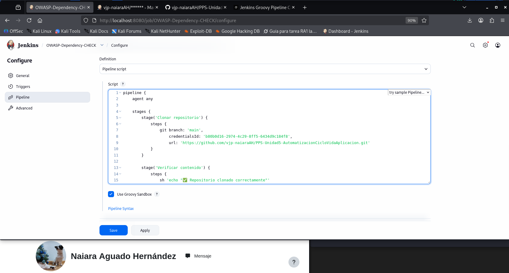
Lo que logré con este ***pipeline*** fue:
+ **Clonar el repositorio** automáticamente desde GitHub.
+ **Verificar el contenido** descargado del proyecto.
+ **Ejecutar el Build + Test** de la aplicación con ***Maven***.
+ **Realizar un análisis estático** del código con ***Checkstyle***.
+ Añadir una **nueva etapa de seguridad con Trivy** para analizar **vulnerabilidades automáticamente**.
+ Generar el archivo ***.jar*** de la aplicación en la fase Package.
+ **Guardar los artefactos y resultados del pipeline** en ***Jenkins*** mediante las ***Post Actions***.
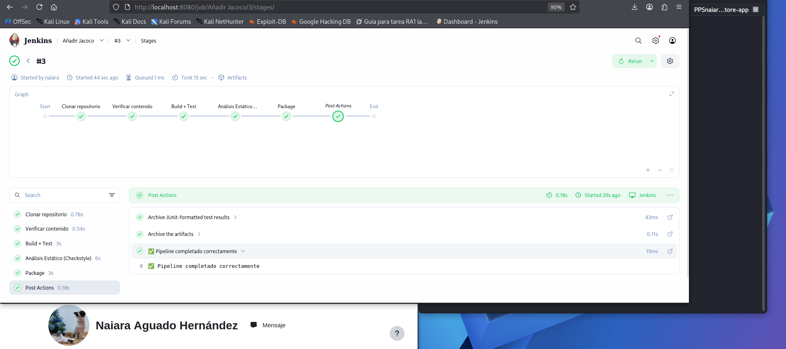

## Conclusión
Con esta práctica he aprendido a **automatizar** todo el ***ciclo de vida*** de una aplicación usando ***Maven***, ***Docker*** y ***Jenkins***. He podido *compilar* la aplicación, *ejecutar tests*, *generar el .jar* y *automatizar todo el proceso con pipelines* en ***Jenkins***. Además, añadí análisis de código con Checkstyle para mejorar la calidad del proyecto. En general, me ha servido para entender mejor cómo funciona un **entorno CI/CD real**.